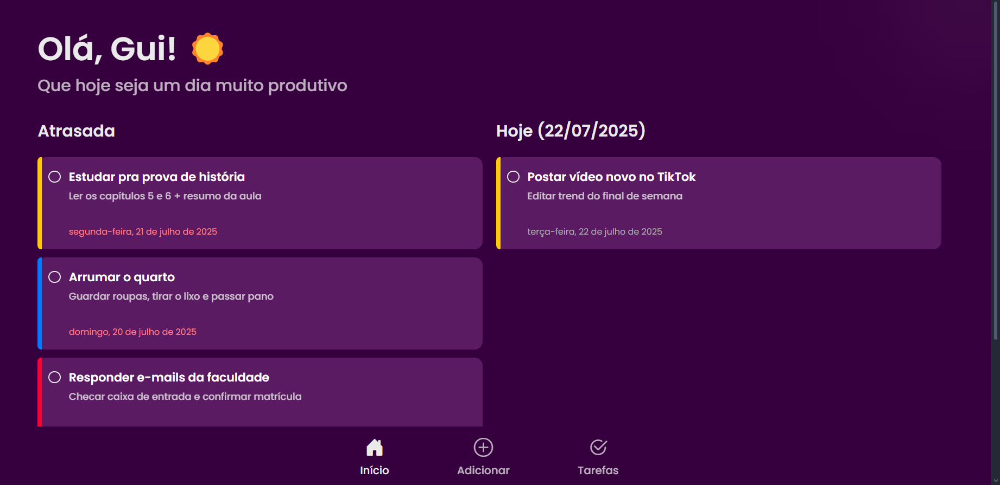
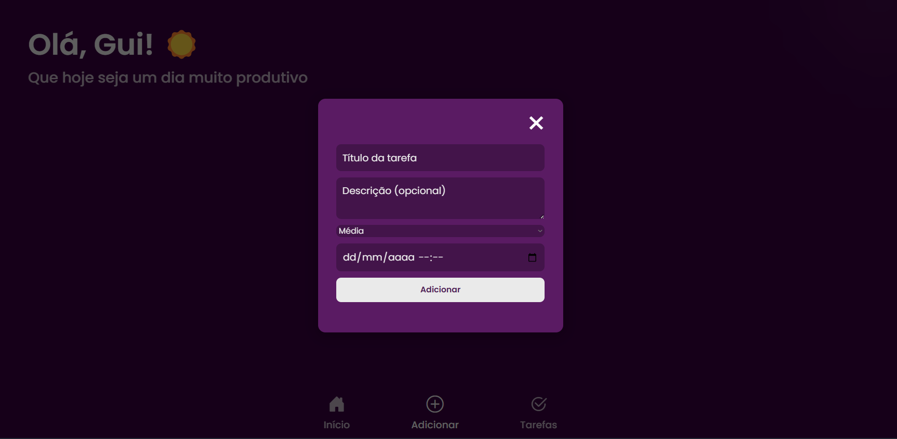
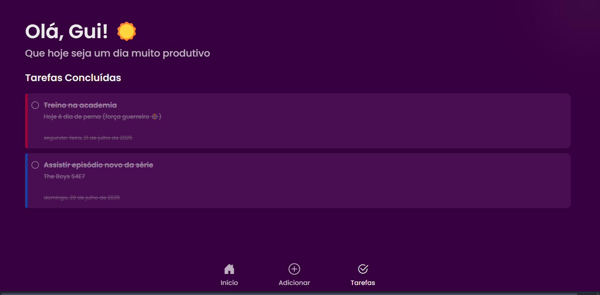

# To-Do App (Lista de Tarefas)

Este é um aplicativo de **lista de tarefas** desenvolvido em **React**, com foco em organização pessoal.  
O projeto permite que o usuário **adicione, edite, conclua e remova tarefas**, com **classificação por prioridade**, **datas-limite** e separação automática entre **tarefas atrasadas**, **do dia atual** e **concluídas**.

---

## 🖥️ Tecnologias Utilizadas
- **React.js**
- **JavaScript (ES6+)**
- **CSS3 (Responsivo e com animações)**
- **Bootstrap Icons**
- **LocalStorage (para salvar as tarefas)**

---

## 📱 Funcionalidades
- Adicionar e editar tarefas com **título, descrição, prioridade e data limite**.
- Separação automática em:
  - **Atrasadas** (datas já passadas).
  - **Hoje** (tarefas do dia atual).
  - **Concluídas** (marcadas pelo usuário).
- **Persistência de dados no LocalStorage**.
- **Interface responsiva** (Desktop, Tablet e Mobile).
- **Menu fixo inferior** para navegação entre páginas.

---

## 📷 Screenshots

### **Tela Inicial (Tarefas Atrasadas e do Dia)**


### **Adicionar / Editar Tarefas**


### **Tarefas Concluídas**


> As imagens acima representam as principais telas do sistema em execução.

---

## 🚀 Como Rodar o Projeto

1. Clone o repositório:
```bash
git clone https://github.com/seu-usuario/seu-repositorio.git 
```


2. Entre na pasta do projeto:
```bash
cd seu-repositorio
```

3. Instale as dependências:
```bash
npm install
```

4. Execute o projeto:
```bash
npm start
```

**O app rodará em** http://localhost:3000.

## 📄 Licença
Este projeto está sob a licença MIT - sinta-se à vontade para utilizar e modificar.

## 👨‍💻 Autor
**Guilherme Furlaneti** -
_Desenvolvedor Full Stack_

**Contatos**
* 📧 Email: gfurlaneti@gmail.com
* 📱 Telefone: (11) 98768-8538
* 💼 LinkedIn: https://linkedin.com/in/gui-furlaneti
* 💻 GitHub: https://github.com/GuiFurlaneti
* 🌐 Portfólio: https://guifurlaneti.github.io/portfolio
